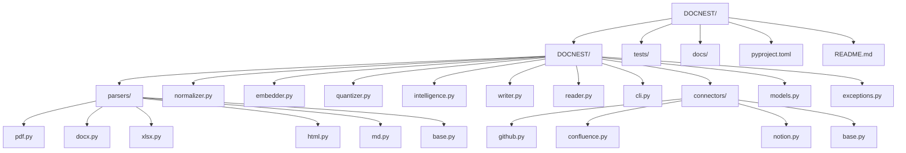
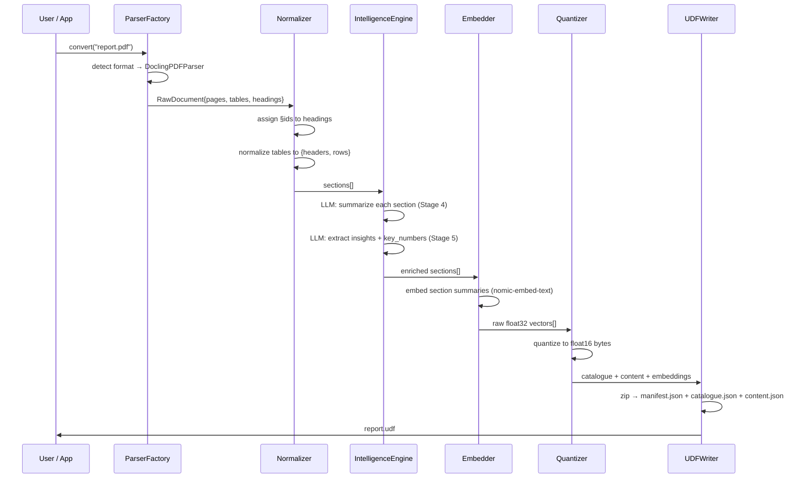

# DOCNEST — Python Library
## Technical Specification v1.0

> **Audience:** Customer, Business Analyst, Architect, Senior Engineer, Market Researcher
> **Status:** Stable · Production
> **Last updated:** 2026-05-23

---

## Table of Contents
1. [Why This Software](#1-why-this-software)
2. [Problem Statement](#2-problem-statement)
3. [Business Impact](#3-business-impact)
4. [Competitive Landscape](#4-competitive-landscape)
5. [Functionality](#5-functionality)
6. [Architecture](#6-architecture)
7. [Folder Structure](#7-folder-structure)
8. [Data Flow](#8-data-flow)
9. [SOLID & Design Patterns](#9-solid--design-patterns)
10. [Interfaces & Classes](#10-interfaces--classes)
11. [Tech Stack & Code](#11-tech-stack--code)
12. [Setup & Installation](#12-setup--installation)
13. [Dependencies & Cost](#13-dependencies--cost)
14. [Test Plan](#14-test-plan)

---

## 1. Why This Software

RAG (Retrieval-Augmented Generation) is the dominant pattern for making LLMs useful on private data. Every company building RAG starts with document ingestion. And almost every company ingests documents the same broken way — extract raw text, split into fixed-size chunks, embed, store.

This approach treats a 40-page financial report the same as a Reddit post. Tables lose their column headers. Sections get cut mid-sentence. Two documents saying the same thing both get retrieved. The LLM receives noise and returns approximate answers.

**DOCNEST is the ingestion layer RAG has always needed but never had.** It understands document structure before embedding anything.

---

## 2. Problem Statement

| Current Pain | Root Cause | DOCNEST Solution |
|---|---|---|
| Answers missing table data | Text extractors flatten tables | Tables preserved as `{caption, headers, rows}` JSON |
| Chunks split mid-sentence | Character-count chunking ignores meaning | Sections are natural boundaries (headings = splits) |
| Wrong documents retrieved | Embeddings on noise produce noisy similarity | BM25 on section keywords + embeddings on clean summaries |
| Cannot cite exact location | No location metadata in chunks | Every section has `§id` — citeable, clickable |
| Re-ingestion is expensive | No change detection | SHA-256 hash — only changed sections re-processed |
| LLM receives too much context | Full documents sent to LLM | Section-scoped retrieval — only the relevant `§section` |

---

## 3. Business Impact

### For the end user
- Answers go from "approximately correct" to "correctly cited with source location"
- Token cost per query: ~2,600 avg (structured) vs 80,000–120,000 (full-doc traditional RAG) — **up to 45× reduction**
- Time to answer: sub-second for pre-computed intelligence vs multi-second LLM calls

### For the business
| Metric | Blind Chunking | DOCNEST |
|---|---|---|
| LLM API cost per 10K queries | ~$80–$200 | ~$4–$14 |
| Answer accuracy (v7 eval, 88 questions) | ~60% | **95.5%** |
| Developer integration time | 1 day | 2 hours (`pip install docnest-ai`) |
| Formats supported | 1–2 | PDF, DOCX, XLSX, HTML, MD, CSV |

### Evaluated accuracy (v7 — May 2026)

88 questions across 10 real-world documents in 5 formats, scored with honest factual analysis:

Latest **reproducible** run (answer model Cerebras `gpt-oss-120b`, repo judge, 88 questions):

| Format | Score | Pass Rate |
|---|---|---|
| XLSX | 9.6 / 10 | 93% |
| DOCX | 9.4 / 10 | 100% |
| HTML | 9.3 / 10 | 100% |
| MD | 8.9 / 10 | 93% |
| PDF (dense research) | 7.0 / 10 | 73% |
| **Overall** | **8.5 / 10** | **89% (78/88)** |

A prior run with the stronger `qwen-3-235b` model reached **9.55/10** (no longer publicly
accessible). Structured/business formats score 8.9–9.6; dense academic PDFs are the hard case.

### Market size
Enterprise RAG market: $1.2B in 2024, projected $8.9B by 2029 (CAGR 49%). Every RAG pipeline is a potential DOCNEST customer.

---

## 4. Competitive Landscape

| Tool | What it does | DOCNEST advantage |
|---|---|---|
| **LangChain loaders** | Load docs, blind chunk | No structure, no intelligence |
| **LlamaIndex** | RAG framework with parsers | Still chunk-based, no pre-computed intelligence |
| **Docling (IBM)** | Document parsing to markdown | Parsing only — no embedding, no intelligence, no .udf |
| **Unstructured.io** | Document parsing API | Cloud-only, expensive, no RAG layer |
| **Azure Document Intelligence** | OCR + extraction | Azure lock-in, no RAG, expensive |
| **DOCNEST** | Parse + structure + embed + intelligence + portable format | Full pipeline, local-first, open spec |

**Gap:** No tool currently combines structured normalization + quantized embeddings + pre-computed intelligence + portable output format in a single open-source Python library.

---

## 5. Functionality

### Core capabilities
- **Parse** 6+ document formats (PDF, DOCX, XLSX, HTML, Markdown, plain text)
- **Normalize** to `§section` hierarchy — headings become navigable IDs
- **Preserve tables** as structured `{caption, headers, rows[]}` JSON — never flattened
- **Summarize** each section in one sentence at ingest time
- **Compute intelligence** — document summary, insights, key_numbers extracted by LLM once
- **Embed** sections using 10+ models via LangChain (HuggingFace, OpenAI, Cohere, etc.)
- **Quantize** embeddings to float32 / float16 / int8 / binary — up to 32× size reduction
- **Write** portable `.udf` zip file with binary `embeddings.bin` blob (87% smaller than base64)
- **Query** with five-layer resolution: pre-computed → BM25 → cosine → section LLM → full doc
- **Organisational metadata** — `owner`, `department`, `tags`, `access_roles` stored in manifest
- **HTML viewer** — `docnest view` generates self-contained browsable HTML
- **Library mode** — `library.json` multi-document index for cross-document search
- **CLI** for direct terminal usage with `--fast` mode (skip LLM, embeddings only)
- **Pluggable providers** — swap LLM, embedder, vector backend, search, storage, OCR via interface

### Input formats
PDF (text + scanned), DOCX, XLSX, CSV/TSV, HTML, Markdown

### Output formats
`.udf` (portable zip archive), `library.json` (multi-document index), HTML (viewer)

### Who is DOCNEST for?

DOCNEST is a **developer and AI pipeline tool**. It is not designed for end-user document management.

| User | How they use DOCNEST |
|---|---|
| **ML / RAG engineer** | Primary audience. Ingests documents into `.udf`, builds query pipelines. |
| **Researcher** | Converts paper collections to queryable knowledge bases. |
| **Backend developer** | Embeds DOCNEST in an API layer behind a product UI. |
| **Data scientist** | Extracts structured table data, section summaries, key numbers from documents. |
| **Enterprise architect** | Evaluates DOCNEST as the ingestion layer for an internal RAG platform. |

**The `.udf` format is intentionally AI-first.** A business analyst or document manager is not expected to open `.udf` files directly. Their interaction with DOCNEST is through:
- A product UI built on top of it (chatbot, search interface, dashboard)
- The HTML viewer: `docnest view report.udf` — opens in browser, fully human-readable
- Exported summaries and insights via the Python API

This positioning is deliberate. Trying to make `.udf` a consumer format would compromise its AI performance characteristics. The bridge to human users is the **application layer** built on top of DOCNEST.

---

## 6. Architecture

```
┌─────────────────────────────────────────────────────────────────────┐
│                        DOCNEST Library                             │
│                                                                     │
│  ┌──────────────┐    ┌──────────────┐    ┌──────────────────────┐  │
│  │  Parser      │    │  Normalizer  │    │  Intelligence Engine  │  │
│  │  Factory     │───▶│  Pipeline    │───▶│  (LLM-powered)       │  │
│  │              │    │              │    │                      │  │
│  │ PDF Parser   │    │ §Section     │    │ Summarizer           │  │
│  │ DOCX Parser  │    │ Assignment   │    │ Insight Extractor    │  │
│  │ XLSX Parser  │    │ Table        │    │ KeyNumber Extractor  │  │
│  │ HTML Parser  │    │ Normalizer   │    │                      │  │
│  │ MD Parser    │    │ Text Cleaner │    └──────────────────────┘  │
│  │ Connectors   │    └──────────────┘              │               │
│  └──────────────┘                                  │               │
│                                                    ▼               │
│  ┌──────────────┐    ┌──────────────┐    ┌──────────────────────┐  │
│  │  Quantizer   │◀───│  Embedder    │◀───│  Section Index       │  │
│  │              │    │  Strategy    │    │  Builder             │  │
│  │ float16      │    │              │    │  (BM25 keywords)     │  │
│  │ int8         │    │ nomic-embed  │    │                      │  │
│  │ binary       │    │ openai       │    └──────────────────────┘  │
│  └──────────────┘    │ google       │                              │
│         │            └──────────────┘                              │
│         ▼                                                           │
│  ┌──────────────────────────────────────────────────────────────┐  │
│  │  UDF Writer                                                  │  │
│  │  manifest.json + catalogue.json + content.json + assets/    │  │
│  └──────────────────────────────────────────────────────────────┘  │
└─────────────────────────────────────────────────────────────────────┘
```

---

## 7. Folder Structure



**Physical layout:**
```
DOCNESTd/
├── docnest/
│   ├── __init__.py
│   ├── models.py           # Pydantic models — Section, Document, Catalogue, DocMeta
│   ├── exceptions.py       # DocNestError, ParseError, EmbedError, SizeLimitError
│   ├── cli.py              # typer CLI entry point (docnest convert/query/inspect/view/library)
│   ├── parsers/
│   │   ├── base.py         # IParser abstract base class + _make_doc_id (CamelCase-aware)
│   │   ├── factory.py      # ParserFactory — returns correct parser for format
│   │   ├── pdf.py          # DoclingPDFParser (primary)
│   │   ├── pymupdf_pdf.py  # PyMuPDFParser (fast fallback)
│   │   ├── docx.py         # DoclingDOCXParser
│   │   ├── xlsx.py         # ExcelParser (openpyxl)
│   │   ├── html.py         # HTMLParser (BeautifulSoup)
│   │   └── md.py           # MarkdownParser (mistletoe)
│   ├── providers/
│   │   ├── __init__.py     # exports all interfaces + factories
│   │   ├── llm.py          # ILLMProvider, LangChainLLMProvider, get_llm_provider
│   │   ├── embedder.py     # IEmbedder, LangChainEmbedder, get_embedder
│   │   ├── vector.py       # IVectorBackend, NumpyVectorBackend, FAISSVectorBackend,
│   │   │                   #   ChromaVectorBackend, get_vector_backend
│   │   ├── search.py       # ISearchProvider, BM25SearchProvider, TFIDFSearchProvider,
│   │   │                   #   KeywordSearchProvider, get_search_provider
│   │   ├── storage.py      # IStorageBackend, ZipStorageBackend, DirectoryStorageBackend,
│   │   │                   #   get_storage_backend
│   │   └── ocr.py          # IOCRProvider, NullOCRProvider, TesseractOCRProvider,
│   │                       #   EasyOCRProvider, get_ocr_provider
│   ├── normalizer.py       # SectionNormalizer — assigns §ids, cleans text
│   ├── intelligence.py     # IntelligenceEngine — LLM calls for summary/insights
│   ├── quantizer.py        # Quantizer — float32 / float16 / int8 / binary
│   ├── writer.py           # UDFWriter — creates .udf zip (+ embeddings.bin binary blob)
│   ├── reader.py           # UDFReader — load and query .udf files (five-layer engine)
│   ├── library.py          # Library layer — library.json multi-document index
│   ├── viewer.py           # HTML viewer — generates self-contained HTML page
│   └── pipeline.py         # DocNestPipeline — orchestrates all stages
├── tests/
│   ├── fixtures/           # sample PDFs, DOCX, XLSX, UDF files for tests
│   ├── test_parsers.py
│   ├── test_normalizer.py
│   ├── test_intelligence.py
│   ├── test_vector_backends.py
│   ├── test_writer.py
│   ├── test_reader.py
│   └── test_pipeline.py
├── docs/
│   └── SPEC_DOCNEST_PYPI.md
├── pyproject.toml
└── README.md
```

---

## 8. Data Flow



---

## 9. SOLID & Design Patterns

### SOLID Compliance

| Principle | Implementation |
|---|---|
| **S** — Single Responsibility | `PDFParser` only parses. `Normalizer` only assigns §ids. `IntelligenceEngine` only calls LLM. Each class has one reason to change. |
| **O** — Open/Closed | `ParserFactory` is open for extension (add `PPTXParser`) without modifying existing parsers. `EmbedderStrategy` accepts new providers without changing the pipeline. |
| **L** — Liskov Substitution | Any `IParser` implementation can replace another — `DoclingPDFParser` and `ExcelParser` both return `RawDocument` and are interchangeable from the pipeline's perspective. |
| **I** — Interface Segregation | `IParser` only declares `parse()`. `IEmbedder` only declares `embed()`. Connectors implement `IConnector` not `IParser`. No fat interfaces. |
| **D** — Dependency Inversion | `DOCNESTPipeline` depends on `IParser`, `IEmbedder`, `IQuantizer` abstractions — not concrete classes. Concrete implementations injected at construction time. |

### Design Patterns

| Pattern | Where | Why |
|---|---|---|
| **Factory** | `ParserFactory` | Selects correct parser from file extension without if/else chains in pipeline |
| **Strategy** | `EmbedderStrategy` | Swap embedding model (nomic, openai, google) without changing pipeline |
| **Pipeline** | `DOCNESTPipeline` | 6 ordered stages, each transforms the data and passes to next |
| **Builder** | `UDFWriter` | Builds the zip incrementally — manifest, catalogue, content, assets |
| **Repository** | `UDFIndex` | Abstracts .udf file access — `query()`, `get_section()`, `get_catalogue()` |
| **Observer** | Progress callbacks | `on_stage_complete` hook for CLI progress display |
| **Template Method** | `BaseParser.parse()` | Defines parse skeleton — subclasses implement `_extract_structure()` |

---

## 10. Interfaces & Concrete Classes

```python
# docnest/parsers/base.py
from abc import ABC, abstractmethod
from docnest.models import RawDocument

class IParser(ABC):
    """Converts a raw file into a structured RawDocument."""

    @abstractmethod
    def parse(self, file_path: str) -> RawDocument:
        """Parse the file and return structured document."""
        ...

    @abstractmethod
    def supports(self, file_path: str) -> bool:
        """Return True if this parser handles the given file."""
        ...

# Concrete implementations
class DoclingPDFParser(IParser): ...      # PDF (text + scanned via OCR) — primary
class PyMuPDFParser(IParser): ...         # PDF fast fallback (PyMuPDF)
class DoclingDOCXParser(IParser): ...     # Word documents
class ExcelParser(IParser): ...           # XLSX via openpyxl
class HTMLParser(IParser): ...            # HTML via BeautifulSoup
class MarkdownParser(IParser): ...        # Markdown via mistletoe
```

```python
# docnest/providers/embedder.py
from abc import ABC, abstractmethod
import numpy as np

class IEmbedder(ABC):
    """Generates embedding vectors for text."""

    @abstractmethod
    def embed(self, texts: list[str]) -> np.ndarray:
        """Return float32 array of shape (n, dims)."""
        ...

    @property
    @abstractmethod
    def dims(self) -> int:
        """Embedding dimensions."""
        ...

# Concrete: LangChainEmbedder wraps any LangChain embeddings model
# e.g. get_embedder("huggingface/all-MiniLM-L6-v2")
#      get_embedder("openai/text-embedding-3-small", api_key="sk-...")
#      get_embedder("cohere/embed-english-v3.0", api_key="...")
```

```python
# docnest/providers/vector.py
from abc import ABC, abstractmethod
import numpy as np

class IVectorBackend(ABC):
    """Pluggable vector similarity search backend."""

    @abstractmethod
    def build(self, ids: list[str], matrix: np.ndarray) -> None:
        """Index the embedding matrix. Called once after embeddings are loaded."""
        ...

    @abstractmethod
    def search(self, query: np.ndarray, k: int = 5) -> list[tuple[str, float]]:
        """Return up to k (section_id, cosine_score) pairs, highest first."""
        ...

    @abstractmethod
    def is_available(self) -> bool:
        """Return True if the required library is installed."""
        ...

    @abstractmethod
    def is_ready(self) -> bool:
        """Return True if build() has been called and the index is populated."""
        ...

# Concrete implementations
class NumpyVectorBackend(IVectorBackend): ...   # default, zero extra deps
class FAISSVectorBackend(IVectorBackend): ...   # faiss-cpu, fast ANN, optional save/load
class ChromaVectorBackend(IVectorBackend): ...  # chromadb, persistent cross-session

# Factory
def get_vector_backend(name: str, **kwargs) -> IVectorBackend: ...
# name: "numpy" | "faiss" | "chroma"
```

```python
# docnest/providers/llm.py
from abc import ABC, abstractmethod

class ILLMProvider(ABC):
    @abstractmethod
    def complete(self, prompt: str, **kwargs) -> str: ...

# LangChainLLMProvider wraps any LangChain chat model
# get_llm_provider("groq", model="llama-3.3-70b-versatile", api_key="gsk_...")
# get_llm_provider("openai", model="gpt-4o-mini", api_key="sk-...")
# get_llm_provider("ollama", model="llama3.2")
# get_llm_provider("anthropic", model="claude-3-haiku-20240307", api_key="...")
```

```python
# DOCNEST/models.py
from pydantic import BaseModel
from typing import Optional

class TableData(BaseModel):
    caption: Optional[str]
    headers: list[str]
    rows: list[list[str]]

class Section(BaseModel):
    id: str                          # "§3.1"
    title: str
    level: int                       # heading level 1-6
    text: str
    tables: list[TableData]
    parent_id: Optional[str]         # "§3"
    children: list[str]              # ["§3.1.1", "§3.1.2"]
    token_count: int
    # Filled by IntelligenceEngine
    summary: Optional[str]
    keywords: list[str]
    # Filled by Embedder + Quantizer
    embedding: Optional[bytes]       # quantized bytes

class Document(BaseModel):
    doc_id: str
    title: str
    source: str                      # file path or URL
    format: str                      # "pdf", "docx", etc.
    sections: list[Section]
    # Filled by IntelligenceEngine
    summary: Optional[str]
    insights: list[str]
    key_numbers: list[dict]

class Catalogue(BaseModel):
    doc_id: str
    title: str
    source: str                      # basename by default (privacy); full path is opt-in
    summary: str
    insights: list[str]
    key_numbers: list[dict]
    section_index: list[dict]        # lightweight — id, title, keywords, summary, embedding
```

---

## 11. Tech Stack & Code

### Tech Stack
| Component | Library | Version | Purpose |
|---|---|---|---|
| Document parsing | `docling` | `>=2.0` | PDF, DOCX parsing + OCR |
| PDF fallback | `pymupdf` | `>=1.24` | Fast PDF text extraction |
| Excel parsing | `openpyxl` | `>=3.1` | XLSX with structure |
| LLM + embeddings | `langchain` | `>=0.2` | Unified 14+ LLM + 10+ embedder providers |
| LLM provider SDKs | `groq`, `openai`, `anthropic`, … | varies | Per-provider API client |
| Data models | `pydantic` | `>=2.7` | Type-safe models |
| CLI | `typer` | `>=0.12` | Command-line interface |
| CLI display | `rich` | `>=13.0` | Progress bars, tables |
| BM25 | `rank-bm25` | `>=0.2.2` | Keyword search index |
| Vector math | `numpy` | `>=1.26` | Cosine similarity, quantization |
| Vector ANN (opt.) | `faiss-cpu` | `>=1.8` | Fast ANN search (FAISSVectorBackend) |
| Vector DB (opt.) | `chromadb` | `>=0.5` | Persistent vector store (ChromaVectorBackend) |
| OCR (opt.) | `pytesseract` / `easyocr` | varies | Scanned document OCR |
| HTML parsing | `beautifulsoup4` | `>=4.12` | HTML heading hierarchy |
| Markdown | `mistletoe` | `>=1.3` | Markdown AST parsing |
| Testing | `pytest` | `>=8.0` | Test framework |
| HTTP (connectors) | `httpx` | `>=0.27` | Async HTTP for connectors |

### Core pipeline implementation

```python
# DOCNEST/pipeline.py
from pathlib import Path
from docnest.parsers.factory import ParserFactory
from docnest.normalizer import SectionNormalizer
from docnest.intelligence import IntelligenceEngine
from docnest.embedder import IEmbedder, NomicEmbedder
from docnest.quantizer import Quantizer
from docnest.writer import UDFWriter
from docnest.models import Document

class DOCNESTPipeline:
    """
    Orchestrates the 6-stage normalization pipeline.
    All dependencies injected — fully testable with mocks.
    """

    def __init__(
        self,
        embedder: IEmbedder | None = None,
        quantization: str = "float16",
        llm_provider: str = "ollama",
        llm_model: str = "llama3.2",
        on_stage_complete: callable | None = None,
    ):
        self.parser_factory = ParserFactory()
        self.normalizer = SectionNormalizer()
        self.intelligence = IntelligenceEngine(
            provider=llm_provider, model=llm_model
        )
        self.embedder = embedder or NomicEmbedder()
        self.quantizer = Quantizer(mode=quantization)
        self.on_stage_complete = on_stage_complete or (lambda stage, doc: None)

    def process(self, file_path: str) -> Document:
        path = Path(file_path)

        # Stage 1 — Parse
        parser = self.parser_factory.get(path)
        raw = parser.parse(str(path))
        self.on_stage_complete("parse", raw)

        # Stage 2 — Normalize structure
        doc = self.normalizer.normalize(raw)
        self.on_stage_complete("normalize", doc)

        # Stage 3 & 4 — Table normalization + section summaries
        doc = self.intelligence.enrich_sections(doc)
        self.on_stage_complete("enrich_sections", doc)

        # Stage 5 — Document-level intelligence
        doc = self.intelligence.enrich_document(doc)
        self.on_stage_complete("enrich_document", doc)

        # Stage 6 — Embed + quantize
        texts = [s.summary or s.text[:500] for s in doc.sections]
        vectors = self.embedder.embed(texts)
        for i, section in enumerate(doc.sections):
            section.embedding = self.quantizer.quantize(vectors[i])
        self.on_stage_complete("embed", doc)

        return doc

    def convert(self, source: str, output: str | None = None) -> str:
        path = Path(source)
        if path.is_dir():
            return self._convert_folder(path, output)
        doc = self.process(source)
        out_path = output or str(path.with_suffix(".udf"))
        UDFWriter(self.embedder, self.quantizer).write(doc, out_path)
        return out_path

    def _convert_folder(self, folder: Path, output: str | None) -> str:
        docs = []
        for f in folder.rglob("*"):
            if self.parser_factory.supports(f):
                docs.append(self.process(str(f)))
        out_path = output or str(folder.parent / f"{folder.name}.udf")
        UDFWriter(self.embedder, self.quantizer).write_library(docs, out_path)
        return out_path
```

```python
# DOCNEST/quantizer.py
import numpy as np
import struct

class Quantizer:
    def __init__(self, mode: str = "float16"):
        assert mode in ("float32", "float16", "int8", "binary")
        self.mode = mode

    def quantize(self, vector: np.ndarray) -> bytes:
        if self.mode == "float32":
            return vector.astype(np.float32).tobytes()
        if self.mode == "float16":
            return vector.astype(np.float16).tobytes()
        if self.mode == "int8":
            scale = 127.0 / (np.abs(vector).max() + 1e-8)
            return (vector * scale).clip(-127, 127).astype(np.int8).tobytes()
        if self.mode == "binary":
            bits = (vector > 0).astype(np.uint8)
            return np.packbits(bits).tobytes()

    def dequantize(self, data: bytes, dims: int) -> np.ndarray:
        if self.mode == "float32":
            return np.frombuffer(data, dtype=np.float32)
        if self.mode == "float16":
            return np.frombuffer(data, dtype=np.float16).astype(np.float32)
        if self.mode == "int8":
            return np.frombuffer(data, dtype=np.int8).astype(np.float32) / 127.0
        if self.mode == "binary":
            bits = np.unpackbits(np.frombuffer(data, dtype=np.uint8))[:dims]
            return bits.astype(np.float32) * 2 - 1
```

---

## 12. Setup & Installation

### For end users
```bash
pip install docnest-ai

# Verify
docnest --version

# With Ollama (local, free)
# 1. Install Ollama: https://ollama.ai
ollama pull llama3.2
ollama pull nomic-embed-text

# 2. Convert a document
docnest convert report.pdf --llm-provider ollama --llm-model llama3.2

# 3. Query it
docnest query report.udf "What are the key findings?"

# With Groq (cloud, fast, free tier)
docnest convert report.pdf \
  --llm-provider groq \
  --llm-model llama-3.3-70b-versatile \
  --api-key gsk_...

# Fast mode (no LLM — embeddings only)
docnest convert report.pdf --fast

# With organizational metadata
docnest convert report.pdf \
  --owner "Alice Smith" \
  --department "Finance" \
  --tags "q4,2024"
```

### For developers integrating docnest
```bash
pip install docnest-ai

# Optional vector backends
pip install docnest-ai[faiss]    # FAISS ANN search
pip install docnest-ai[chroma]   # ChromaDB persistent store
pip install docnest-ai[ocr]      # Tesseract OCR for scanned PDFs

# Full install with all optional deps
pip install docnest-ai[all]
```

### For contributors
```bash
git clone https://github.com/tailorgunjan93/DOCNESTd
cd DOCNESTd
python -m venv .venv && source .venv/bin/activate   # Windows: .venv\Scripts\activate
pip install -e ".[dev]"
pytest tests/ -v
```

---

## 13. Dependencies & Cost

### Python packages
| Package | License | Cost |
|---|---|---|
| `docling` | MIT | Free |
| `fastembed` | Apache 2.0 | Free |
| `litellm` | MIT | Free (pay your LLM provider) |
| `rank-bm25` | Apache 2.0 | Free |
| `pydantic` | MIT | Free |
| `typer` | MIT | Free |
| `rich` | MIT | Free |
| `cryptography` | Apache 2.0 / BSD | Free |
| `openpyxl` | MIT | Free |
| `httpx` | BSD | Free |
| `numpy` | BSD | Free |

### LLM costs (intelligence stages only — paid once per document)
| Provider | Model | Cost per 100-page doc |
|---|---|---|
| Ollama | llama3.2 | **Free** (local compute) |
| Groq | llama-3.3-70b-versatile | ~$0.01 |
| OpenAI | gpt-4o-mini | ~$0.05 |
| Anthropic | claude-3-haiku-20240307 | ~$0.03 |
| Google | gemini-1.5-flash | ~$0.01 |

### Embedding costs
| Provider | Model | Cost per 100-page doc |
|---|---|---|
| HuggingFace (local) | all-MiniLM-L6-v2 | **Free** |
| OpenAI | text-embedding-3-small | ~$0.002 |
| Cohere | embed-english-v3.0 | ~$0.001 |
| Google | text-embedding-004 | Free tier (1M tokens/month) |

---

## 14. Test Plan

### Unit tests
```python
# tests/test_parsers.py
import pytest
from docnest.parsers.factory import ParserFactory
from docnest.parsers.pdf import DoclingPDFParser

class TestParserFactory:
    def test_returns_pdf_parser_for_pdf(self):
        factory = ParserFactory()
        parser = factory.get("report.pdf")
        assert isinstance(parser, DoclingPDFParser)

    def test_raises_for_unsupported_format(self):
        factory = ParserFactory()
        with pytest.raises(ValueError, match="Unsupported format"):
            factory.get("file.xyz")

class TestPDFParser:
    def test_parse_returns_raw_document(self, fixtures_dir):
        parser = DoclingPDFParser()
        raw = parser.parse(str(fixtures_dir / "sample.pdf"))
        assert raw.doc_id is not None
        assert len(raw.sections) > 0

    def test_tables_are_structured(self, fixtures_dir):
        parser = DoclingPDFParser()
        raw = parser.parse(str(fixtures_dir / "table_doc.pdf"))
        tables = [s for s in raw.sections if s.tables]
        assert len(tables) > 0
        assert tables[0].tables[0].headers is not None
```

```python
# tests/test_normalizer.py
from docnest.normalizer import SectionNormalizer
from docnest.models import RawDocument, Section

class TestSectionNormalizer:
    def test_assigns_section_ids(self):
        raw = RawDocument(sections=[
            Section(title="Introduction", level=1, text="..."),
            Section(title="Background", level=2, text="..."),
        ])
        doc = SectionNormalizer().normalize(raw)
        assert doc.sections[0].id == "§1"
        assert doc.sections[1].id == "§1.1"

    def test_parent_child_links_correct(self):
        raw = make_raw_with_hierarchy()
        doc = SectionNormalizer().normalize(raw)
        assert doc.sections[1].parent_id == doc.sections[0].id
```

```python
# tests/test_quantizer.py
import numpy as np
from docnest.quantizer import Quantizer

class TestQuantizer:
    def test_float16_roundtrip(self):
        q = Quantizer("float16")
        vec = np.random.randn(768).astype(np.float32)
        compressed = q.quantize(vec)
        recovered = q.dequantize(compressed, 768)
        assert np.allclose(vec, recovered, atol=0.01)

    def test_binary_size_reduction(self):
        q = Quantizer("binary")
        vec = np.random.randn(1536).astype(np.float32)
        compressed = q.quantize(vec)
        assert len(compressed) == 1536 // 8   # 192 bytes vs 6144 bytes
```

### Integration tests
```python
# tests/test_pipeline.py
class TestDOCNESTPipeline:
    def test_end_to_end_pdf(self, tmp_path, fixtures_dir):
        pipeline = DOCNESTPipeline(llm_provider="ollama", llm_model="llama3.2")
        out = pipeline.convert(str(fixtures_dir / "annual_report.pdf"),
                               output=str(tmp_path / "out.udf"))
        assert Path(out).exists()
        assert Path(out).stat().st_size > 0

    def test_folder_creates_library_udf(self, tmp_path, fixtures_dir):
        pipeline = DOCNESTPipeline()
        out = pipeline.convert(str(fixtures_dir / "reports/"),
                               output=str(tmp_path / "library.udf"))
        from docnest.reader import UDFIndex
        index = UDFIndex.load(out)
        assert index.catalogue.doc_count > 1
```

### Test coverage targets
| Module | Target coverage |
|---|---|
| parsers/ | 90% |
| normalizer.py | 95% |
| intelligence.py | 80% (LLM mocked) |
| embedder.py | 85% |
| quantizer.py | 100% |
| writer.py | 90% |
| reader.py | 90% |
| pipeline.py | 85% |
